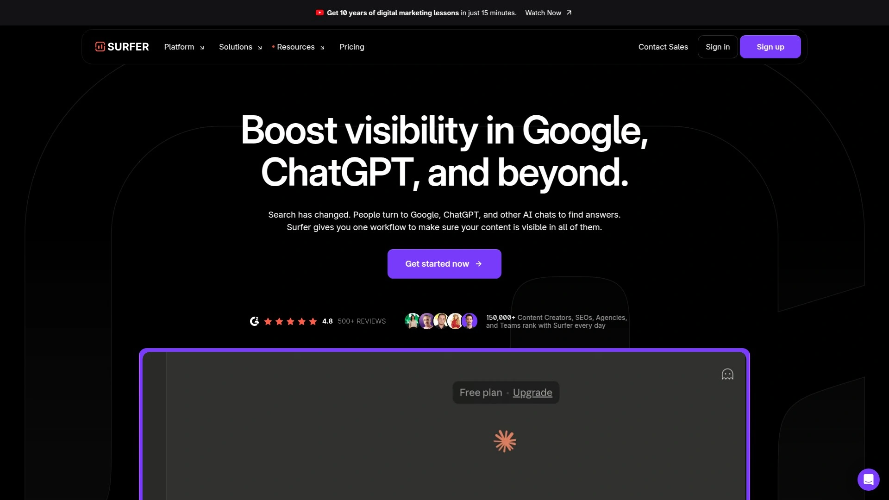
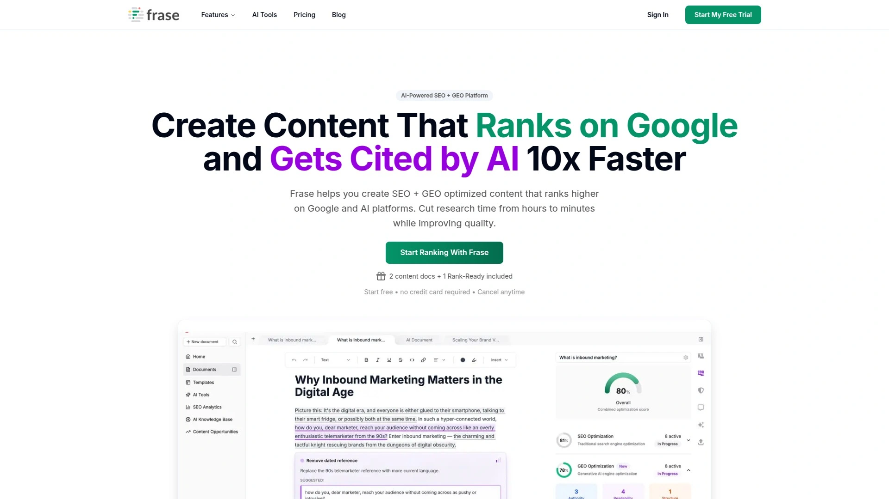
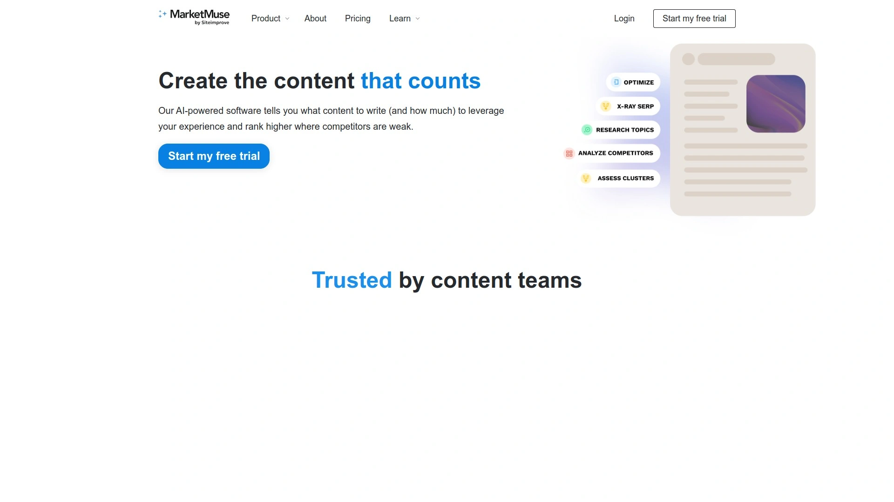
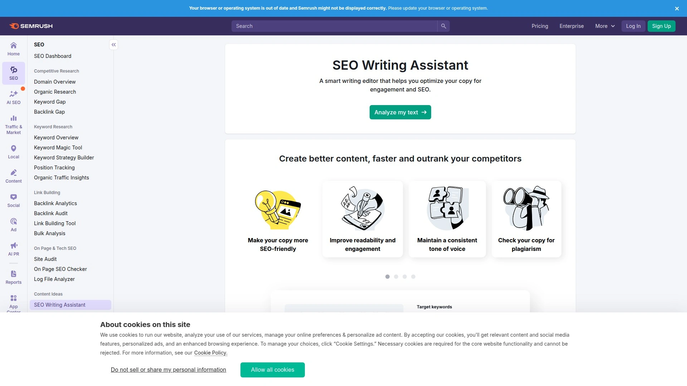
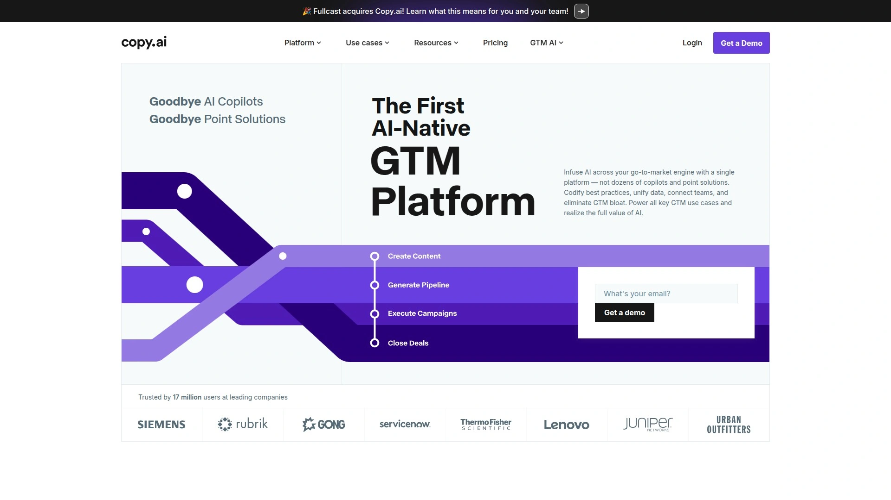
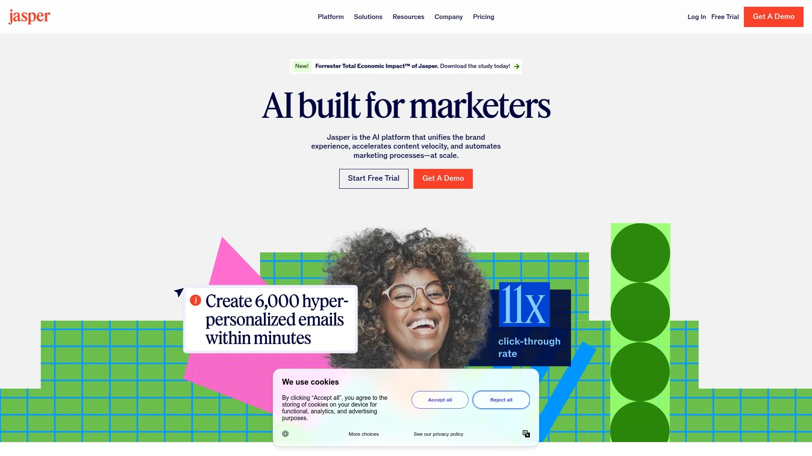
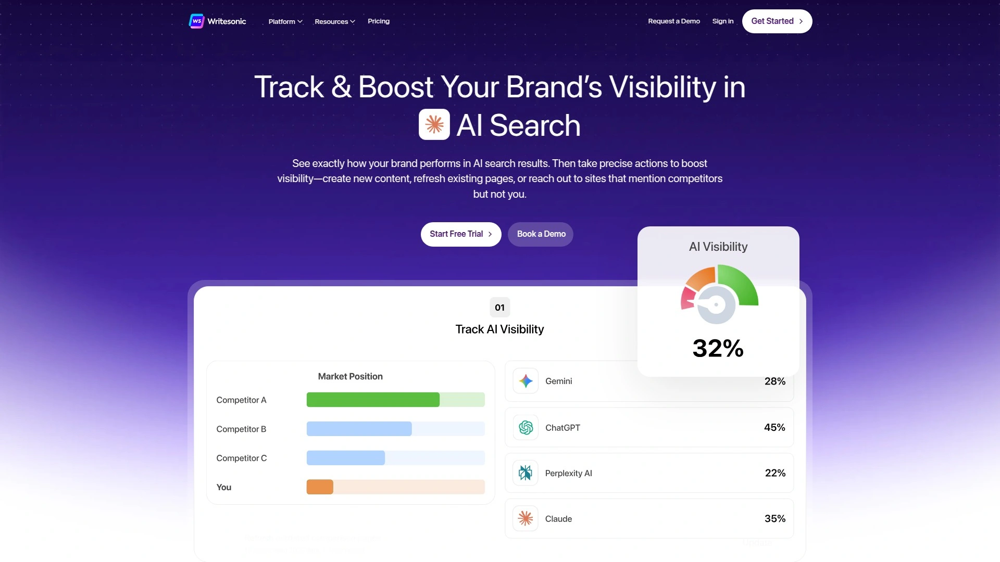
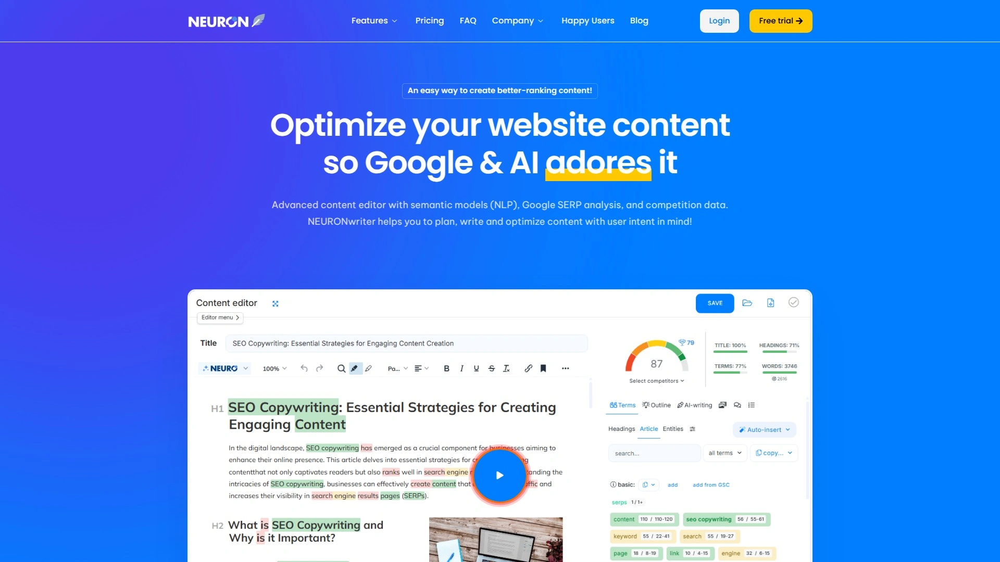

# Latest AI Content Optimization Curated List (Including Real-Time Analysis)

Creating content that actually ranks feels like solving a puzzle while blindfolded. You write what you think Google wants, publish hopefully, then watch competitors somehow land above you with half the effort. AI-powered SEO content tools changed that dynamic completely by analyzing what currently ranks, extracting patterns from top performers, and giving you a data-backed roadmap before writing a single word. Modern platforms now handle keyword research, competitor analysis, content briefs, and real-time optimization scores—tasks that used to consume entire workdays. Smart content teams report cutting research time by 70% while seeing ranking improvements within weeks instead of months.

## **[Outranking](https://www.outranking.io)**

SERP-first approach built for actual rankings.

This platform distinguishes itself through real-time SERP analysis that happens before you write anything. Instead of guessing what works, Outranking pulls data from pages currently dominating search results and builds structured outlines around proven ranking factors. The AI understands search intent first, then generates content engineered specifically to compete with top performers.

Automated content briefs save enormous time—comprehensive research documents appear in minutes rather than hours. SEO managers appreciate how the platform replaces five separate tools by consolidating keyword research, competitor monitoring, content optimization, and performance tracking into one interface. The writing assistance goes beyond simple suggestions to provide factual, relevant content recommendations based on actual SERP data.

Users consistently mention the clean, intuitive interface that makes complex optimization feel manageable. WordPress integration means you can optimize and publish without switching platforms. The SEO scoring system predicts performance before publishing, letting you refine articles until they hit competitive benchmarks.

Quality matters more than speed here—the platform prioritizes creating content that ranks over churning out volume. Quick content creation still happens through streamlined workflows, but always anchored to data-driven insights. For teams focused on organic traffic growth through strategic content, this platform delivers measurable improvements.

## **[Surfer SEO](https://surferseo.com)**

Data-driven content optimization with 500+ ranking signals.

Founded in 2017, Surfer analyzes over 500 on-page SEO signals to determine what makes content rank. The platform examines top-performing pages and delivers insights on word count, keyword density, content structure, and formatting patterns. Real-time optimization happens as you write, with the content editor providing on-screen suggestions for filling gaps.

The SERP Analyzer breaks down search results into key ranking factors, showing correlations between elements like content length and SERP positions. Content Planner helps develop data-driven strategies for building topical relevance. Keyword research tools find content opportunities and create clusters for quick strategy development.

AI capabilities expanded significantly with features like auto-optimize, AI outlines, auto internal linking, content detectors, and content humanizers. These tools automate repetitive optimization tasks at scale. Version history for auto-optimize and API access support agencies managing multiple client accounts.

The approach emphasizes replicating what currently works rather than guessing at general SEO principles. This leads to structured, data-backed content though some users note it can produce formulaic results if not balanced with creativity. Monthly pricing starts accessibly with higher tiers for agencies and enterprises.

## **[Frase](https://frase.io)**

Dual optimization for Google rankings and AI citations.

Frase pioneered content optimization specifically for both traditional search engines and generative AI platforms. The platform now tracks separate SEO scores for Google and GEO scores for ChatGPT, Perplexity, Claude, and Gemini. This dual approach ensures content performs everywhere users search, not just one channel.

The workflow guides you through five steps: analyze top Google results, discover user questions, generate AI outlines, track combined scores, and receive real-time recommendations. Question extraction identifies what users actually ask about topics, critical for getting cited by AI platforms that prioritize direct answers.

Context-aware topic analysis understands content like humans do, suggesting specific relevant terms instead of generic keywords. Before recent upgrades, the system might suggest vague terms like "question" or "times"—now it recommends precise concepts like "Conversational AI" or "Customer Service". Intelligent topic clustering organizes recommendations logically.

Integration with content creation tools simplifies workflows for teams. The content brief generator automates research, while the optimizer provides specific suggestions for improving both search visibility and AI platform citations. Real-time scoring shows how changes impact performance immediately.

## **[Clearscope](https://www.clearscope.io)**

Intent-focused optimization with exceptional data accuracy.

Clearscope built its reputation on delivering accurate, intent-focused keyword data that guides writers toward what actually matters. The platform surfaces information from Google Autocomplete and related searches to show which topics, terms, and questions deserve coverage. Content reports analyze top-ranking competitors to identify gaps and opportunities.

The content scoring system grades writing and provides actionable suggestions for improvement. Keyword discovery goes beyond simple volume metrics to reveal semantic relationships between terms. Integration with common content tools like Google Docs streamlines workflows without forcing platform switching.

Monitoring features flag SEO issues including 404 errors, crawl problems, and indexing challenges. Content inventory management tracks performance across your entire site. The platform emphasizes creating content that matches search intent perfectly, improving relevance and engagement simultaneously.

Customer support earns consistent praise for responsiveness and helpfulness. The interface balances powerful features with accessibility, though new users may need time to fully grasp all capabilities. Pricing ranges from $189 to $399 monthly, positioning it as a premium option. For agencies and established content teams prioritizing accuracy over affordability, Clearscope justifies the investment.

## **[MarketMuse](https://www.marketmuse.com)**

AI-powered content planning with topical authority measurement.

MarketMuse differentiates through comprehensive content strategy capabilities beyond simple optimization. The platform assesses your site against entire SERPs to determine what to create and update based on topic value. Content plans analyze competitive forces and recommend specific items for creation versus optimization.

Topic Authority metrics establish whether your site demonstrates expertise in subject areas. This measurement influences rankings significantly as search engines prioritize authoritative sources. The audit tool identifies content decay and lost rankings, then uses AI to generate refresh briefs.

Topic Navigator pulls related keywords with associated metrics, filterable by CPC and search volume. SERP X-Ray analyzes the top 20 results for keywords, providing details on images, links, search intent, and content scores. The Content Optimizer recommends keyword inclusion frequency and target content scores.

Personalized metrics help teams make informed decisions aligned with existing topical presence. Content briefs outline key topics, subtopics, questions to answer, and linking opportunities. The platform saves dozens of research hours while incorporating topic expertise into content decisions. Case studies show companies achieving significant traffic growth through strategic implementation.

## **[Semrush SEO Writing Assistant](https://www.semrush.com/swa/)**

Real-time optimization integrated into your writing environment.

The SEO Writing Assistant provides instant recommendations as you write, analyzing content for SEO potential, readability, originality, and tone consistency. Integration with Google Docs, WordPress, and MS Word means you optimize without leaving familiar environments.

The tool delivers SEO recommendations on keyword incorporation, preferred text length, meta descriptions, and title tags. Semantic formatting ensures well-structured, search-friendly content. Readability scoring maintains digestibility and engagement across audiences. Tone of voice features preserve brand consistency.

Plagiarism checking catches duplicate content before publication. Link checking identifies broken URLs that damage SEO performance. AI-powered composition and rewriting tools speed up drafting significantly. Overall article quality assessments provide quick performance snapshots.

Installation takes minutes across platforms through marketplace add-ons and plugins. The sidebar interface provides guidance without cluttering your writing space. Recommendations update dynamically based on content changes, showing immediate scoring impacts. Teams using broader Semrush tools benefit from integrated workflows connecting keyword research, content creation, and performance tracking.

## **[Copy.ai](https://www.copy.ai)**

GTM-focused platform automating content workflows.

Copy.ai positions itself as a comprehensive go-to-market AI platform rather than simple text generation. The system automates marketing and sales workflows including content creation, demand generation, and sales enablement. This holistic approach ensures content aligns with broader business strategies.

Advanced language models including GPT-4 generate engaging, on-brand content across formats—blog posts, ads, product descriptions, emails, and social media. The platform helps overcome writer's block and ideation challenges while maintaining consistent brand voice.

Pre-built, customizable workflows deliver immediate value without requiring AI expertise. These templates function like frameworks teams can adapt to specific needs. Open API connectivity integrates seamlessly with existing marketing stacks, unifying operations.

Content bottlenecks, personalization needs, and localization challenges become manageable through AI-powered generation. Teams rapidly create content, personalize assets, and adapt messaging across markets. Over 130 templates and recipes guide various content types. The platform scales creative output without sacrificing quality or brand consistency.

## **[Jasper AI](https://www.jasper.ai)**

Marketing-focused AI with 30+ content templates.

Jasper specializes in marketing content creation, offering over 50 templates that streamline everything from blog writing to ad copy. The platform mirrors human writing patterns and improves through usage, avoiding the gibberish many AI tools produce.

Blog content generation happens remarkably fast—thorough outlines or first drafts appear in as little as 10 minutes. Recipe for creating posts walks you through topic input, keyword selection, tone choice, and audience targeting. The AI generates well-structured content you can customize with personal touches.

Product description creation follows similar workflows, filling out product names, details, tone, and target audience to receive multiple compelling options. Ad copy generation helps create messages that convert. Email composition tools produce compelling messages that inspire action.

The platform includes 30+ free AI writing tools and generators covering headlines, Instagram captions, meta descriptions, job descriptions, schemas, and more. Jasper Chat functions as an AI assistant responding to text or voice commands. Text-to-image generation creates striking visuals to accompany written content. Pricing accommodates various budgets with plans designed for individuals, teams, and businesses.

## **[Writesonic](https://writesonic.com)**

High-volume content generation with SEO integration.

Writesonic transforms simple sentences or keywords into full-length articles through machine learning. Article Writer 4.0 integrates with SEO tools to suggest relevant keywords with volume, traffic estimates, and difficulty scores. The system properly incorporates selected keywords throughout generated content.

Four-step blog generation customizes output at every stage. Start by entering topics, let the tool suggest keywords, review generated blog topic ideas, and finally receive complete SEO-optimized articles exceeding 2,000 words. Instant Article Writer creates content immediately by simply adding topic ideas.

Sonic Editor provides three modes—Focus, Sonic, and Surfer—each boosting productivity and effectiveness. Plagiarism checking ensures 100% originality. Integration with WordPress and 4,000+ apps through Zapier simplifies content management.

Bulk generation capabilities produce 1,000+ content pieces in one click by uploading spreadsheets, saving 30 hours weekly. Photosonic adds AI image generation for visual storytelling. Free trial offers 25 credits without requiring credit cards, letting you test capabilities risk-free. Pricing includes unlimited and business plans accommodating different scales.

## **[NeuronWriter](https://neuronwriter.com)**

Semantic SEO combined with NLP optimization.

NeuronWriter merges semantic SEO with natural language processing to deliver deep optimization insights. The platform analyzes top Google results through advanced NLP, extracting relevant keywords and semantically related terms. Customized recommendations include ranking criteria, content scores, and optimal word counts.

AI-driven suggestions come from analyzing high-ranking pages, offering data-backed recommendations for improving your own content. Auto-Insert-Terms automatically recommends and integrates unused keywords and synonyms. Search engine optimization features suggest relevant headings and structure.

The minimalist interface enhances usability through clean layouts and clearly labeled icons. Customizable settings adjust font sizes, color schemes, and workspace layouts to personal preferences. Generated articles include tailored outlines completed in minutes.

Keyword research delivers metrics like ranking criteria and content scoring. The built-in editor provides plagiarism checking and internal link suggestions. Integration with tools like Perplexity AI creates powerful workflows combining research and optimization. The platform excels at helping content rank through meticulous semantic analysis.

## How do AI content tools actually improve rankings?

These platforms analyze hundreds of ranking factors from top-performing pages, identifying patterns in word count, keyword usage, content structure, and semantic relationships. By replicating these data-backed elements, your content matches what search engines currently reward. Real-time scoring shows exactly where gaps exist compared to competitors. Teams using optimization platforms report 30-50% ranking improvements within 8-12 weeks by following data-driven recommendations instead of guessing.

## Can these tools replace human writers completely?

Not yet, despite impressive capabilities. AI excels at research, outlining, drafting, and optimization but lacks nuanced understanding of brand voice, creative angles, and emotional resonance. The best workflow combines AI speed with human expertise—let tools handle time-consuming research and initial drafts, then add strategic thinking and refinement. Content performing best typically starts AI-generated but receives substantial human editing for accuracy, originality, and engagement.

## Which platform works best for small teams versus enterprises?

Small teams with limited budgets benefit from platforms like Frase or Surfer SEO offering comprehensive features at accessible price points starting under $100 monthly. These provide strong optimization without overwhelming complexity. Enterprises managing dozens of writers across multiple brands need platforms like MarketMuse or Clearscope that support collaboration, content inventory management, and sophisticated authority tracking. Consider workflow integration needs—teams already using Semrush gain efficiency from their Writing Assistant.

## Conclusion

Content marketing stopped being about who writes most and became about who optimizes smartest. Search engines now reward depth, relevance, and authority over keyword stuffing and volume tactics that worked five years ago. [Outranking](https://www.outranking.io) leads this shift by starting every piece with SERP analysis rather than guessing games, building structured outlines from actual ranking data, and scoring content against competitive benchmarks before publication. The platform consolidates research, optimization, and performance tracking into workflows that cut production time while improving results. For teams tired of creating content that disappears into search result obscurity, this data-first approach transforms guesswork into measurable growth.

[2](https://skywork.ai/skypage/en/Outranking-Review-(2025):-My-Deep-Dive-into-the-AI-SEO-Powerhouse/1975063125914480640)
